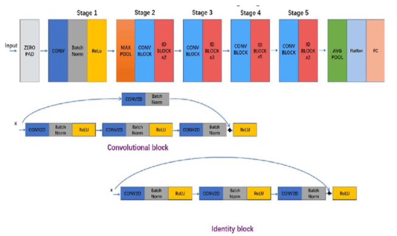
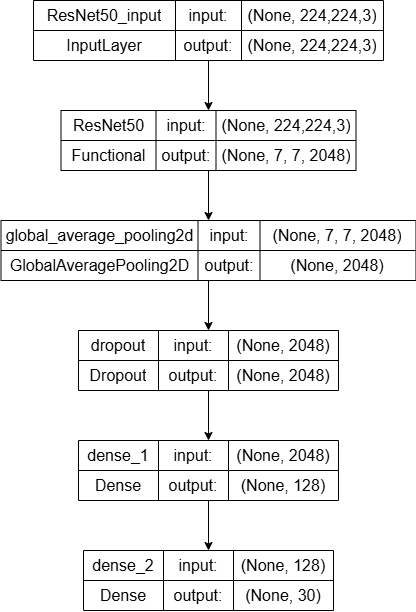

# FreshMate - Machine Learning Team (C242-PS007)

## Project Overview

The project was created to help fruit farmers, fruit sellers, and consumers sort fruits into three categories: unripe, ripe, and rotten. The ultimate goal is to prevent food waste while minimizing financial losses caused by fruit selection errors. The model analyzes images and makes accurate predictions using a Convolutional Neural Network (CNN) architecture and the TensorFlow framework. In addition, the prediction results include information regarding the fruit's content.


## Table of Contents

- [Project Overview](#project-overview)
- [Dataset](#dataset)
- [Data Preprocessing](#data-preprocessing)
- [Model Architecture](#model-architecture)
- [Training](#training)
- [Model Conversion](#model-conversion)
- [Usage](#usage)
- [Contributors](#contributors)

## Dataset

This dataset was obtained by scraping images from some websites and can be accessed via the following [link](https://storage.googleapis.com/dataset-dragon-frost/New_Asing_Classification.zip). It contains 10 fruit images divided into 3 categories: Unripe, Ripe, and Rotten.

- **Training Data**: `train_dataset_final` directory
- **Validation Data**: `validation_dataset_final` directory

## Data Preprocessing

The dataset used for the fruit classification and prediction model consists of various types of fruits, with images categorized as unripe, ripe, or rotten. This dataset includes a wide range of fruits commonly consumed by people.

The data augmentation model enhances the diversity and size of the dataset. Using TensorFlow's data augmentation techniques, the images are flipped, rotated, translated, adjusted for contrast, and zoomed. These processes help improve the model's ability to generalize and make more accurate predictions.
The preprocessing steps include:

- Resizing images to 224x224 pixels.
- Applying various augmentations such as random brightness, contrast, saturation, hue adjustments, flipping, rotation, and zooming.

## Model Architecture



Agrawal, S.A., Rewaskar, V.D., Agrawal, R.A., Chaudari, S.S., Patil, Y. & Agrawal, N.S. (2023). Advancements in NSFW Content Detection: A Comprehensive Review of ResNet-50 Based Approaches. In *International Journal of Intelligent System And Applications In Engineering* (pp. 41-45).

The model is built using the ResNet50 architecture with pre-trained weights from ImageNet. The architecture includes:

- The base model utilizes ResNet50 with its top layers removed.
- GlobalAveragePooling2D is applied to simplify the spatial dimensions of a tensor.  
- Dropout layer is included to minimize overfitting.
- Dense layers are applied to extract features.   
- The output layer employs a softmax activation function to perform classification.  



## Training

The model is trained using:

- **Optimizer**: Adam with a learning rate of 0.001.
- **Loss Function**: Categorical Crossentropy.
- **Metrics**: Accuracy.

The training process includes callbacks for:

- Saving the best model.
- Early stopping if the validation accuracy has reached 91%.
- Reducing the learning rate when the validation loss plateaus.

## Model Conversion

The trained model was transformed into TensorFlow.js format to enable seamless integration with our Android application through an API. This approach was chosen to lessen the device's workload and ensure optimal performance. The process involved the following steps:

- Exporting the Keras model in TensorFlow SavedModel (h5) format.
- Converting the SavedModel into TensorFlow.js format.
- Compressing the TensorFlow.js model directory to facilitate convenient downloading.

## Usage

To use the model, follow these steps:

1. **Clone the repository**.
   ```sh
   git clone https://github.com/ryanfa03/FreshMate-.git
2. **Install the required dependencies** in your Google Colab/Jupyter Notebook.
   ```sh
    pip install tensorflow pandas numpy opencv-python matplotlib
3. **Open the Notebooks** directory in the cloned repository and access the notebook files.
4. **Run the code cells** in the notebooks to train the machine learning model and evaluate its performance.
5. **Save the trained model as model.h5** for later use and reference.
6. **Convert the trained model to the TensorFlow JS (TF.js)** format using the supplied code, and save it as tfjs_model.zip.

## Authors

- [Dudi Nurdiyansah](https://github.com/dudinurdiyans)
- [Ryan Ferdinand Andyson](https://github.com/ryanfa03)
- [Maulida Kiatuddin](https://github.com/moliirsa)

## Contributing
Feel free to contribute to this project by sharing your ideas, suggestions, or enhancements via a pull request. Kindly ensure that your contributions align with the project's goals.

## Acknowledgments
This project is part of the Bangkit Academy 2024 Batch 2 capstone project by Team C242-PS007. Special thanks to our advisors who helped us through our capstone project journey especially Mr. Ferry Yun Kurniawan & Mr. Mirza Ukasyah Yazdani for their guidance and support.
