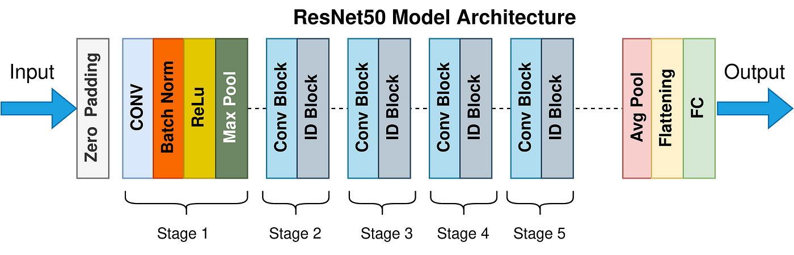

# FreshMate - Machine Learning Team (C242-PS007)

## Project Overview

The project was created to help fruit farmers, fruit sellers, and consumers sort fruits into three categories: unripe, ripe, and rotten. The ultimate goal is to prevent food waste while minimizing financial losses caused by fruit selection errors. The model analyzes images and makes accurate predictions using a Convolutional Neural Network (CNN) architecture and the TensorFlow framework. In addition, the prediction results include information regarding the fruit's content.


## Table of Contents

- [Project Overview](#project-overview)
- [Dataset](#dataset)
- [Data Preprocessing](#data-preprocessing)
- [Model Architecture](#model-architecture)
- [Training](#training)
- [Model Conversion](#model-conversion)
- [Usage](#usage)
- [Contributors](#contributors)

## Dataset

The dataset used in this project is obtained from [this source](https://storage.googleapis.com/dataset-dragon-frost/New_Asing_Classification.zip). It contains 10 fruit images with 3 categories: Unripe, Ripe, Rotten.

- **Training Data**: `train_dataset_final` directory
- **Validation Data**: `validation_dataset_final` directory

## Data Preprocessing

The dataset used for the Fruit Classification model consists of images categorized as suitable or not suitable for consumption by people. It includes a variety of food items (20 Classes) commonly consumed by pregnant women.

Data augmentation techniques enhance the dataset's diversity and size. The ImageDataGenerator class from TensorFlow is used for rescaling, rotation, zooming, flipping, shifting, shearing, and adjusting the brightness of the images. This helps improve the model's ability to generalize and make accurate predictions.
The preprocessing steps include:

- Resizing images to 224x224 pixels.
- Converting images to grayscale.
- Normalizing pixel values.
- Applying various augmentations such as random brightness, contrast, saturation, hue adjustments, flipping, rotation, and zooming.

## Model Architecture



Sandler, M., Howard, A., Zhu, M., Zhmoginov, A., & Chen, L.-C. (2018). Resnet: Inverted Residuals and Linear Bottlenecks. In *Proceedings of the IEEE Conference on Computer Vision and Pattern Recognition* (pp. 4510-4520).

The model is built using the ResNet50 architecture with pre-trained weights from ImageNet. The architecture includes:

- A base model from ResNet50 with the top layers removed.
- Additional dense layers for feature extraction.
- Batch normalization and dropout layers to reduce overfitting.
- An output layer with a softmax activation function for classification.


## Training

The model is trained using:

- **Optimizer**: Adam with a learning rate of 0.001.
- **Loss Function**: Categorical Crossentropy.
- **Metrics**: Accuracy.

The training process includes callbacks for:

- Saving the best model.
- Early stopping if the validation accuracy has reached 95%.
- Reducing the learning rate when the validation loss plateaus.

## Model Conversion

The trained model is converted to TensorFlow.js format to integrate the model with our Android application using an API. This decision was made to reduce the device's load and minimize performance impact. The steps include:

- Saving the Keras model in TensorFlow SavedModel(h5) format.
- Converting the SavedModel to TensorFlow.js format.
- Compressing the TensorFlow.js model folder for easy download.

## Usage

To use the model, follow these steps:

1. **Clone the repository**.
   ```sh
   git clone https://github.com/rifialdiif/ASING-.git
2. **Install the required dependencies** in your Google Colab/Jupyter Notebook.
   ```sh
    pip install tensorflow pandas numpy opencv-python matplotlib
3. **Navigate to the Notebooks** directory within the cloned repository and open the notebook files.
4. **Execute the code cells** within the notebooks to train the machine learning model and assess its performance.
5. **Save the trained model as model.h5** for future reference and use.
6. **Convert the trained model to the TensorFlow JS (TF.js)** format using the provided code and save it as tfjs_model.zip.

## Authors

- [Dudi Nurdiyansah](https://github.com/dudinurdiyans)
- [Ryan Ferdinand Andyson](https://github.com/ryanfa03)
- [Maulida Kiatuddin](https://github.com/moliirsa)

## Contributing
Feel free to contribute to this project by submitting your ideas, suggestions, or improvements through a pull request. Please ensure that your contributions are relevant to this project.

## Acknowledgments
This project is part of the Bangkit Academy 2024 Batch 2 capstone project by Team C242-PS007. Special thanks to our advisors who helped us through our capstone project journey especially Mr. Ferry Yun Kurniawan & Mr. Mirza Ukasyah Yazdani for their guidance and support.
